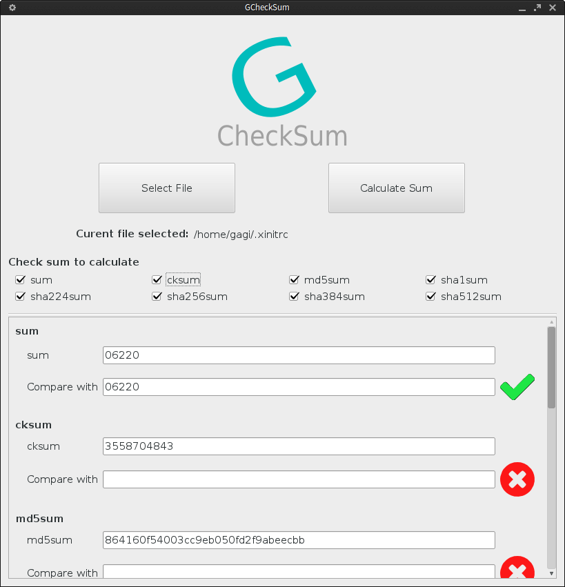

# GCheckSum

GCheckSum is GUI frontend for Unix system.util sums. It's written with C++ && Qt framework.
A very simple GUI where you can select file and calculate sums or compare sums.

### Screenshots


### Install
Currently there is only 32bit package for Arch. But you can build executable by yourself.
Executing following commands will make executable:
```sh
qmake-qt5
make
```
Executable will be at build/target.
Ofcourse you have to install `qt5-base` package if you doo't have it already.


