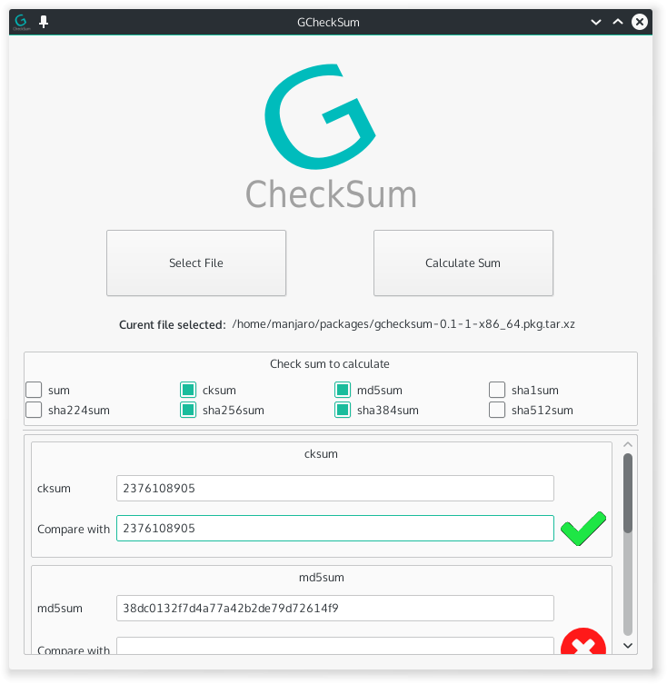

# GCheckSum

GCheckSum is GUI frontend for Unix system.util sums. It's written with C++ && Qt framework.
A very simple GUI where you can select file and calculate sums or compare sums.

**Sums:**
* sum
* cksum
* md5sum
* sha1sum
* sha224sum
* sha256sum
* sha384sum
* sha512sum

### Dependencies
* qt5-base

### Screenshots




### Install
For now there is packages only for Arch GNU/Linux. I will try to make .deb and .rpm packages. If you want to help please contact me.

#### Arch && Arch-based GNU/Linux
Just run following command:
```bash
yaourt -S gchecksum
```

Or download pkg package:
* [32bit](https://github.com/gagiD/GCheckSum/blob/master/pkg/gchecksum-0.1-1-i686.pkg.tar.xz?raw=true)
* [64bit](https://github.com/gagiD/GCheckSum/blob/master/pkg/gchecksum-0.1-1-x86_64.pkg.tar.xz?raw=true)

#### Binaries(it may not work :/)
You can download binaries: 
* [32bit](https://github.com/gagiD/GCheckSum/blob/master/bin/32/gchecksum?raw=true)
* [64bit](https://github.com/gagiD/GCheckSum/blob/master/bin/64/gchecksum?raw=true)

#### Build by yourself
Download source and in source root run following commands:
```bash
qmake-qt5
make
```
Executable will be at build/target.

### Links
* [AUR](https://aur.archlinux.org/packages/gchecksum/)
